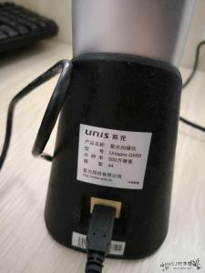
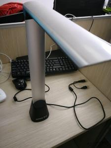
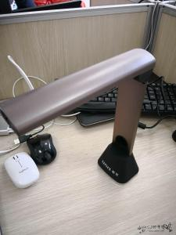
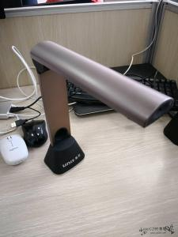
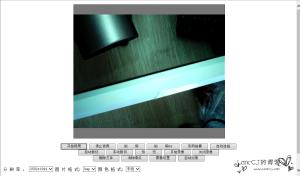
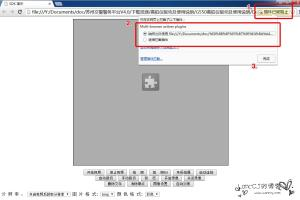
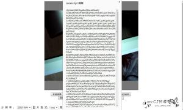

## 文章简介

项目中用到了清华紫光高拍仪(G550)来实现点击按钮进行拍照，然后将拍摄的照片上传到后台数据库中进行保存。而这样在页面调用硬件的功能往往需要通过调用ActiveXObject,这是IE的东西，其他非IE内核的浏览器还没办法去调用，只能通过安装插件来调用。更加不幸的是，在Chrome 41,FireFox 52 这两个版本后禁用了NPAPI，什么意思呢，就是你去安装插件的时候直接提示没认证这一类，没法安装。针对部分项目实在需要这样调用硬件，我们只能使用老的浏览器来实现了，假如大家还有其他办法在高版本上面调用，麻烦一定要告诉我，在这里谢谢了！！

这次我主要来实现下清华紫光高拍仪(G550)载IE，Chrome V41 64位 (链接:https://pan.baidu.com/s/1d49BQ2  密码:mfwb),FireFox V52 64位(链接:https://pan.baidu.com/s/1htNuphU  密码:blby)上面实现调用。

## 两款高拍仪展示
* G550

* S710

## 准备下这次的软件及资料
G550 链接:https://pan.baidu.com/s/1pMU76wr  密码:gv19

S710 链接:https://pan.baidu.com/s/1i6Hm8PR  密码:vdjn

chrome.r39.crx  链接:https://pan.baidu.com/s/1kVW1uo3  密码:5o6r

 1.清华紫光高拍仪(G550)驱动exe安装程序

 2.Ocx插件安装bat

 3.针对 Chrome V41,FireFox V52 的插件，以及一个Multi-browser activex.exe程序,这是网友提供的
            
## 注意点
1.假如以前安装过驱动什么的，请写在干净，否则可能会出现弹窗 测试，这是因为没有读取到设备内部的授权文件导致的，因为没有写在干净

2.请确保你插的头是主USB，不是那个补充供电的,如G550截图中第二张所示

3.TWAIN试用老的调用，比如G550。SDK方式可以老的也可以新的，所以这个自行看型号，SDK支持的硬件应该更多些，建议用这个

以上是我在很多机器上面的总结

## 步骤(TWAIN方式调用/SDK方式调用)
#### TWAIN方式调用(只支持G550)

1.卸载干净之前安装过的有关高拍仪的程序

  1.1一般是Unis开头的，都卸载干净

  1.2还遇到过紫光识别的,名字忘记了

2.安装驱动程序UnisCameraTWAIN_V1.0.1.exe  这是twain调用的方式,紫光硬件后来提供了SDK的方式

3.安装Ocx

4.安装chrome.r39.crx插件，这是Chrome的

5.安装Multi-browser activex.exe(针对Chrome,Firefox,IE不需要)

6.测试

 

#### SDK方式调用(都支持，这个是紫光提供的,建议使用这个，客户安装简单)

1.同样，卸载干净以前安装的驱动如上

2.直接安装UnisproSDK_V3.1.3.2_20170615.exe，其他啥的都不需要安装，例如上面的Ocx还手动安装下

3.安装chrome.r39.crx插件，这是Chrome的

4.安装Multi-browser activex.exe(针对Chrome,Firefox,IE不需要)

5.测试
##  测 试
这里分别有Chrome,Firefox,IE的测试调用，他们因为代码写法不同，自己注意下。

如下是调用的截图

* G550

  * IE

  
  

  * Chrome（需要浏览器右上角允许调用插件）

  
  

* S710
  * IE同上

  * Chrome（需要浏览器右上角允许调用插件）同上
