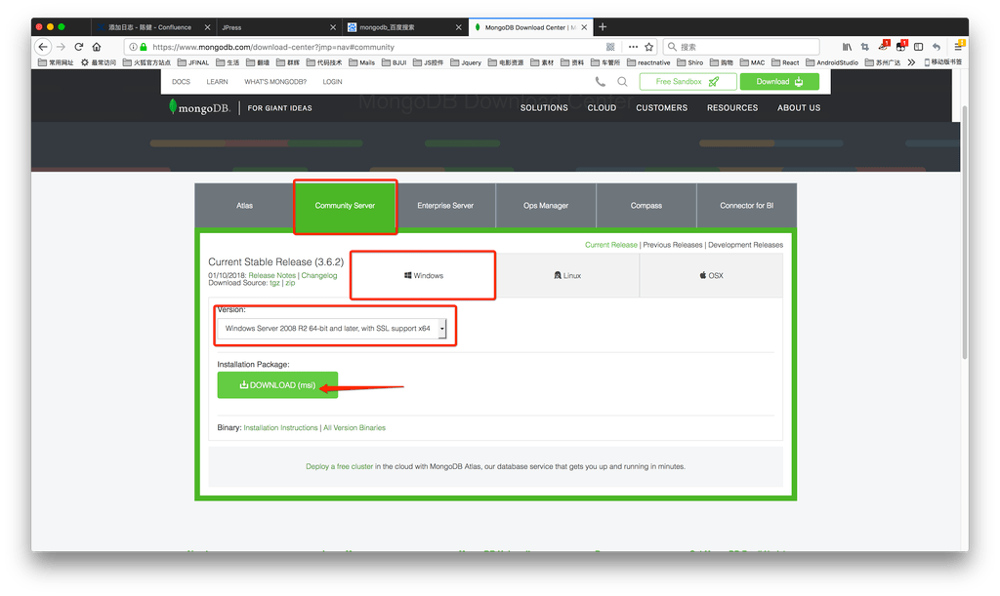
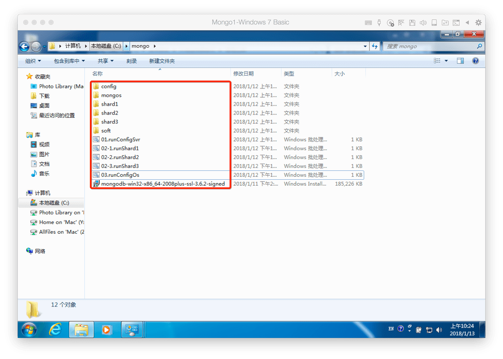
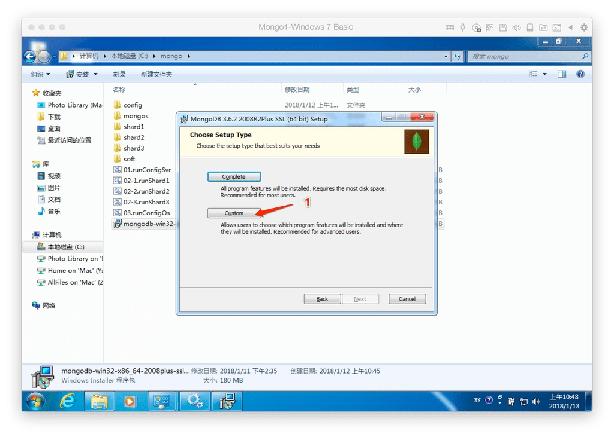
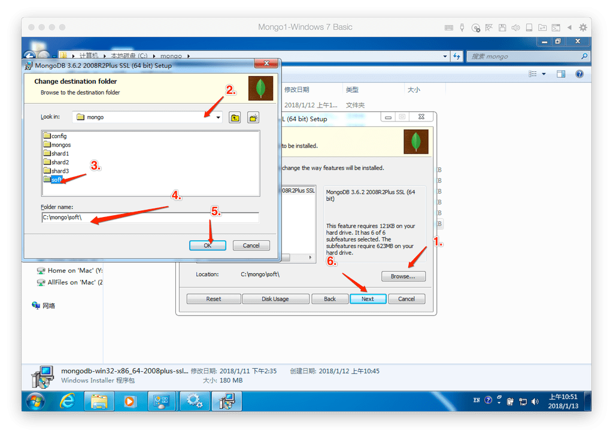
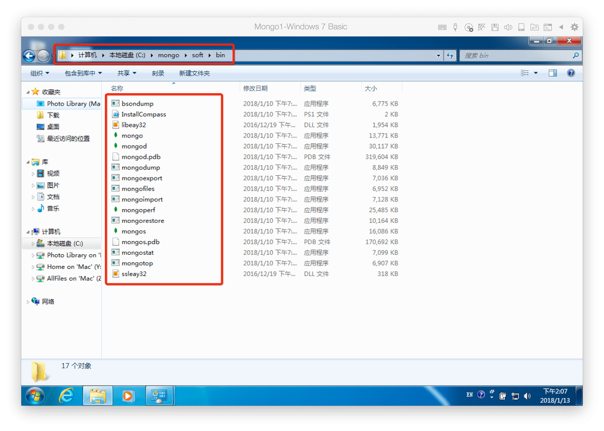
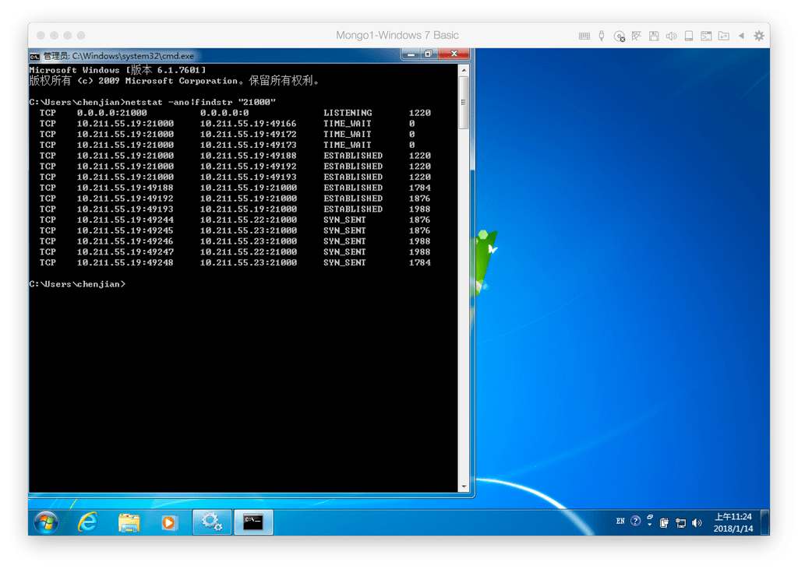

看此文章需要对MongDB有基础知识什么是配置服务，路由服务，分片服务的概念。本次带来在Windows平台上搭建MongoDB分片副本集的操作过程。最后有

视频提供，很贴心！

搭建MongoDB的架构图，来源网络


本次我的三台机器情况是Windows 7 SP1 64位，都是虚拟机来着，IP分别是10.211.55.19,10.211.55.22,10.211.55.23

提一点：系统不是SP1的话打不开MongoDB会报错api-ms-win-crt-runtime缺失这个报错在视频中就出现了，依据视频的方式解决即可。

我在生产环境的Windows Server 2008R2 中uechuxian这个问题，先打了SP1的升级包然后安装Vc库解决的,这个网上也有相关的信息


## 目录软件准备
搭建的目录准备及软件(以下目录及配置文件   链接:https://pan.baidu.com/s/1qZ1yJyG  密码:7s4y   文本命令)
目录结构说明
* ——config 配置服务文件夹
  * –data 配置服务数据存储文件夹
  * –log 配置服务日志文件夹
* ——shard1  分片1服务文件夹
  * –data 分片1服务数据存储文件夹
  * –log 分片1服务日志文件夹
* ——shard2  分片1服务文件夹
  * –data 分片1服务数据存储文件夹
  * –log 分片1服务日志文件夹
* ——shard3 分片1服务文件夹
  * –data 分片1服务数据存储文件夹
  * –log 分片1服务日志文件夹
* ——mongos 路由服务文件夹
  * –log

软件下载:      下载网址:https://www.mongodb.com/





至此我们准备工作完毕后，目录结构应该这样子  本次部署将该目录放置于C盘下



## 软件安装
直接双击我们目录的exe文件，安装目录选择soft即可。







安装结束目录是这样的




## 配置(config)服务命令行启动（需要在3台机器上面都执行一遍）
目录已经创建好，我们准备下配置文件，内容如下（其实这些参数的来源我们可以在CMD命令提示符中数据mongo.exe -help
mongod.exe -help mongos.exe -help查看)  

```
dbpath=C:\mongo\config\data
logpath=C:\mongo\config\log\configsvr.log
logappend=true
noauth = true
port=21000
bind_ip=0.0.0.0
replSet=replConf
```

dbpath    服务数据存储路径

logpath   服务运行日志存储路径

logappend 日志记录以拼接的方式不断记录  true  启用   false 不启用

noauth    是否使用非认证登录

port        服务的运行端口

bind_ip   服务绑定ip,及开放给别人进行访问这个服务的ip地址，不写默认是127.0.0.1  这里配置0.0.0.0是本地所有ip。假如默认不去配置该项

我们在命令提示符中使用  
```
netstat -ano|findstr "21000"
```
会显示127.0.0.1:21000  这样别的ip地址无法访问到该服务
 replSet   服务副本集名称,仅配置（config）服务启动参数需要配置此项，这项的意义在于我们后面启动Mongos服务时候配置中需要这一项，否则在3.6.2版本中会报错。之前我在Linux中使用2.4.8没有强制要求该项配置，导致在Windows搭建就有报错了，现在知道是版本的问题导致的其他的服务配置都是如此的结构，假如有特殊的我会重新说明 !!!想这样我们一个配置(config)服务的配置文件准备好了，我们需要执行下运行命令
```
C:\mongo\soft\bin\mongod.exe --configsvr -f C:\mongo\config\configsvr.conf
```

我将这个命令配置成了bat开启服务，开启后也是弹出命令提示符，日志都记录在那个logpath的文件里面,像上面我们可以查看下21000这个端口是否开机了监听等待其他服务在连接,相同的运行命令

```
netstat -ano|findstr "21000"
```

图中显示我们启用的21000端口正在等待连接


