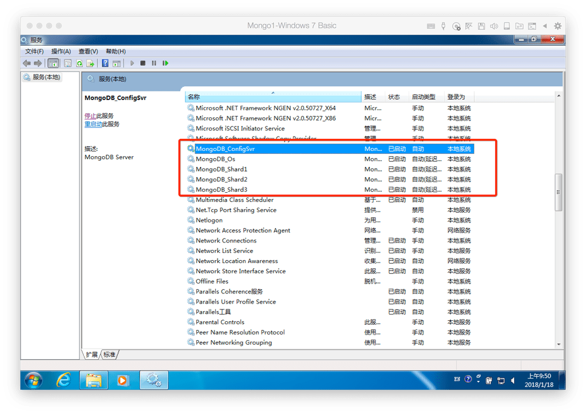

## 命令设置需要分片存储的数据库和数据库(database)里面的集合(table)
连接随便一个 路由服务节点
```
mongo.exe 10.211.55.19:20000
```
切换admin数据库
```
use admin
```
设置具体哪个数据库数据存储需要分片,指定testdb分片生效
```
db.runCommand( { enablesharding :"testdb"});
```
一个数据库不是所有的集合都需要分片的，所以还需要设置具体哪个集合(我们俗称的表),设置下存储的片键，这里是设置为id
```
db.runCommand( { shardcollection : "testdb.table1",key : {id: 1} } )
```
切换到testdb数据库
```
use  testdb;
```
往table1里面插入数据
```
for(var i=0;i<=100;i++){
	db.table1.save({id:i,"test1":"testval1"})
}
```
查看分片情况如下
```
db.table1.stats();
```
有时候我们使用GridFS来存储文件，然后会将文件存储在数据库的fs.chunks中，默认这个是不会进行分片存储的，所以使用到这块的还需要自己设置下
```
db.runCommand( { shardCollection : "table1.fs.chunks" , key : { files_id : 1 , n : 1 } } )
```
其中table1.fs.chunks这个是集合table1的GridFS存储的集合，后面的是片键设置


## 查看各个服务的运行状态

## 将各个服务注册到Windows系统服务自动启动
现在打开服务就是CMD的命令提示符窗口  很不美观 而且不利于启动服务
所以我们可以将这些服务注册到Windows系统服务，这样就算计算机出现宕机重启后也能重新加入服务
我们先使用mongod.exe -help来查看下注册服务的参数有哪些
* Windows Service Control Manager options:
  * –install                    install Windows service
  * –remove                     remove Windows service
  * –reinstall                  reinstall Windows service (equivalentto –remove followed by –install)
  * –serviceName arg            Windows service name
  * –serviceDisplayName arg     Windows service display name
  * –serviceDescription arg     Windows service description
  * –serviceUser arg            account for service execution
  * –servicePassword arg        password used to authenticate serviceUser

我们只需要在之前bat文件里面的命令上面继续添加参数即可

* –install                      注册到系统服务
* –serviceName                  服务名设置
* –serviceDisplayName           服务显示名设置，不设置就会都是MongDB可以试下

我先将一台服务器上面的全部关闭

Config服务注册服务命令

```
C:\mongo\soft\bin\mongod.exe --configsvr -f C:\mongo\config\configsvr.conf --install --serviceName "MongoDB_ConfigSvr"           --serviceDisplayName "MongoDB_ConfigSvr"

```
分片1服务注册到服务命令

```
C:\mongo\soft\bin\mongod.exe --shardsvr --replSet shard1 -f C:\mongo\shard1\configchard1.conf --install --serviceName "MongoDB_Shard1" --serviceDisplayName "MongoDB_Shard1"
```

分片2服务注册到服务命令

```
C:\mongo\soft\bin\mongod.exe --shardsvr --replSet shard2 -f C:\mongo\shard2\configchard2.conf --install --serviceName "MongoDB_Shard2" --serviceDisplayName "MongoDB_Shard2"

```
分片3服务注册到服务命令

```
C:\mongo\soft\bin\mongod.exe --shardsvr --replSet shard3 -f C:\mongo\shard3\configchard3.conf --install --serviceName "MongoDB_Shard3" --serviceDisplayName "MongoDB_Shard3"
```

路由服务注册命令

```
C:\mongo\soft\bin\mongos.exe -f C:\mongo\mongos\configos.conf --install --serviceName "MongoDB_Os" --serviceDisplayName "MongoDB_Os"
```




## 使用Web项目来调用MongoDB存储

视频地址:[点击前往](https://v.youku.com/v_show/id_XMzMxMzM0ODcwMA==.html?spm=a2hzp.8244740.0.0)

## 操作流程视频

视频地址:[点击前往](https://v.youku.com/v_show/id_XMzMxMzM0ODcwMA==.html?spm=a2hzp.8244740.0.0)