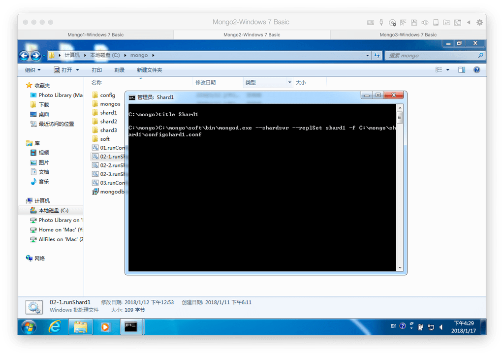
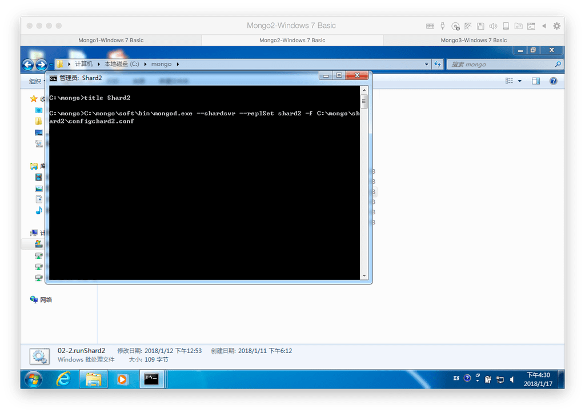
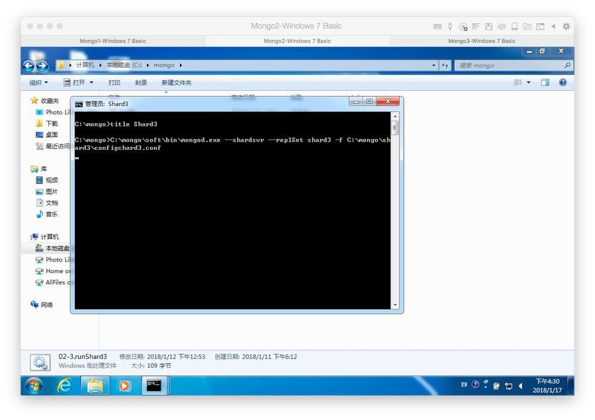
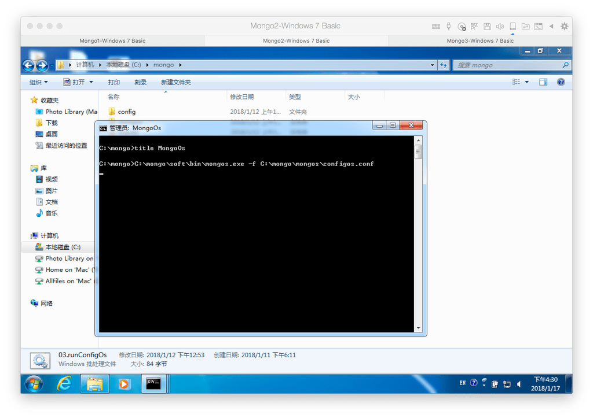

## 分片1(shard1)服务命令行启动
我们依次的在三台机器上面执行启动命令,此处我们执行事先准备的bat
```
C:\mongo\soft\bin\mongod.exe --shardsvr --replSet shard1 -f C:\mongo\shard1\configchard1.conf
```




## 分片2(shard2)服务命令行启动
我们依次的在三台机器上面执行启动命令,此处我们执行事先准备的bat
```
C:\mongo\soft\bin\mongod.exe --shardsvr --replSet shard2 -f C:\mongo\shard2\configchard2.conf
```




## 分片3(shard3)服务命令行启动
我们依次的在三台机器上面执行启动命令,此处我们执行事先准备的bat
```
C:\mongo\soft\bin\mongod.exe --shardsvr --replSet shard3 -f C:\mongo\shard3\configchard3.conf
```




## 路由(monogs)服务命令行启动
我们依次的在三台机器上面执行启动命令,此处我们执行事先准备的bat
```
C:\mongo\soft\bin\mongos.exe -f C:\mongo\mongos\configos.conf
```



## 配置(config)副本集配置
我们随便连接一台服务器的  配置服务节点 在CMD中执行命令
```
mongo.exe 10.211.55.19:21000
```

然后我们将配置节点配置到config这个变量中，直接复制如下内容

```
config = { _id:"replConf", members:[
                     {_id:0,host:"10.211.55.19:21000"},
                     {_id:1,host:"10.211.55.22:21000"},
                     {_id:2,host:"10.211.55.23:21000"}
                ]
         }
``` 
然后执行初始化命令

```
rs.initiate(config)
```

## 分别片1(shard1)副本集配置
我们连接到一台非仲裁节点

```
mongo.exe 10.211.55.19:22001
```
然后切换到admin数据库，执行命令
```
use admin
```
然后设置副本集的config参数值,将内容直接复制进去CMD中
```
config = { _id:"shard1", members:[
                     {_id:0,host:"10.211.55.19:22001"},
                     {_id:1,host:"10.211.55.22:22001"},
                     {_id:2,host:"10.211.55.23:22001",arbiterOnly:true}
                ]
         }
```
然后初始化这段配置，执行命令
```
rs.initiate(config);  
```

## 分别片2(shard2)副本集配置
同分片1一样依次执行命令，确认在非仲裁节点上面，这个很重要
```
mongo.exe 10.211.55.19:22002
```
```
use admin
```
```
config = { _id:"shard2", members:[
                     {_id:0,host:"10.211.55.19:22002"},
                     {_id:1,host:"10.211.55.22:22002",arbiterOnly:true},
                     {_id:2,host:"10.211.55.23:22002"}
                ]
         }
```
```
rs.initiate(config); 
```
## 分别片3(shard3)副本集配置
同分片1一样依次执行命令，确认在非仲裁节点上面，这个很重要
```
mongo.exe 10.211.55.19:22003
```
```
use admin
```
```
config = { _id:"shard3", members:[
                     {_id:0,host:"10.211.55.19:22003",arbiterOnly:true},
                     {_id:1,host:"10.211.55.22:22003"},
                     {_id:2,host:"10.211.55.23:22003"}
                ]
         }
```
```
rs.initiate(config);
```

## 路由(mongos)与分片(shard)串联配置
为什么有这一步，主要是让路由节点知道我们存在分片然后等有数据存储的时候将数据存储到分片上面

首先我们随便连接到一台路由节点服务上面,执行命令

```
mongo.exe 10.211.55.19:20000
```

同样的我们也是需要切换到admin数据库

```
use  admin
```

串联路由服务器与分配副本集1
```
db.runCommand( { addshard : "shard1/10.211.55.19:22001,10.211.55.22:22001,10.211.55.23:22001"});
```
串联路由服务器与分配副本集2

```
db.runCommand( { addshard : "shard2/10.211.55.19:22002,10.211.55.22:22002,10.211.55.23:22002"});
```

串联路由服务器与分配副本集3

```
db.runCommand( { addshard : "shard3/10.211.55.19:22003,10.211.55.22:22003,10.211.55.23:22003"});
```

查看分片服务器的配置

```
db.runCommand( { listshards : 1 } );
```

至此呢，我们已经完成了3台的部署且分片已经设置完毕，但是我们现在直接去存储我们文件的时候，文件数据是不会去分片存储到我们分片副本集上面，他可能只是在某一个上面存储。所以我们需要下一步，设置启用分片存储，而这个设置是针对数据库中的集合设置的，可以理解为对数据库中哪张表进行分片存储,我在下一篇说明下怎样设置。

