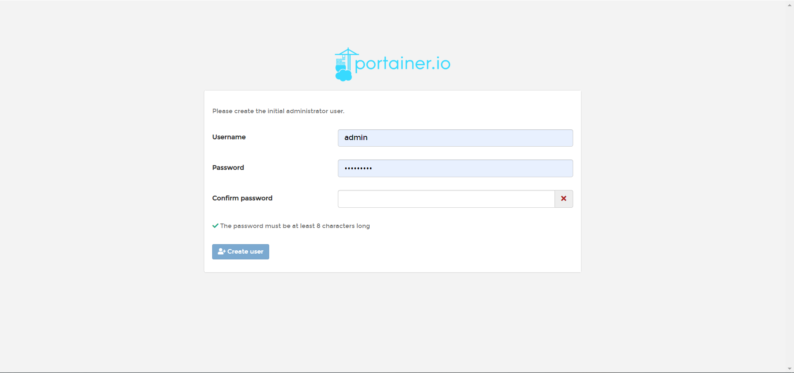
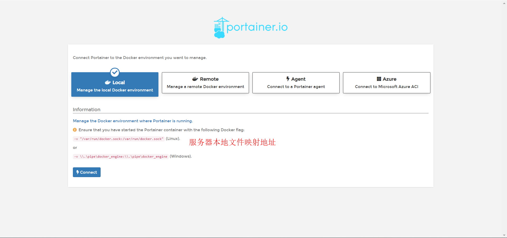
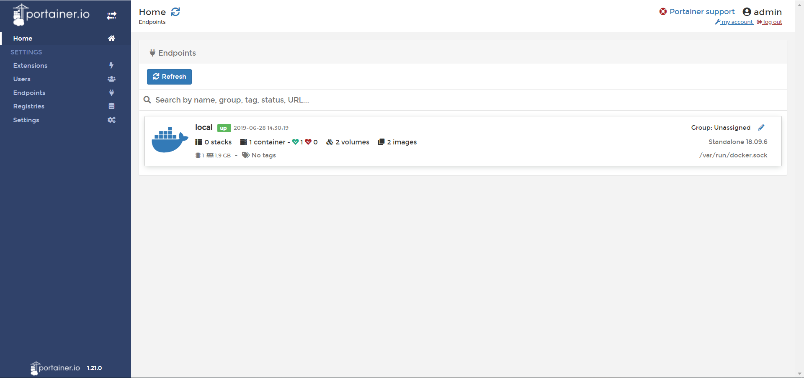

## 简介
现在docker部署越来越流行，目前都是脚本化进行部署，很希望通过图形化界面进行管理，抛开命令行的方式，对于我这样的懒人来说就需要这么一个平台去管理，所以选Portainer来助我一臂之力

## 资源准备
* 一台洁净无瑕的服务器
    * 手头有阿里云的服务器一枚 CentOS 7.6 64位
* 聪明的头脑+勤劳的双手    

## 配置服务器
* 防火墙设置

## 安装docker
通过SSH线连接到自己的Linux服务器

安装一些必要的系统工具：
```
sudo yum install -y yum-utils device-mapper-persistent-data lvm2
```
添加软件源信息：
```
sudo yum-config-manager --add-repo http://mirrors.aliyun.com/docker-ce/linux/centos/docker-ce.repo
```
更新 yum 缓存：
```
sudo yum makecache fast
```
安装 Docker-ce：
```
sudo yum -y install docker-ce
```
启动 Docker 后台服务
```
sudo systemctl start docker
```
测试运行 hello-world
```
docker run hello-world
```

至此安装docker完毕

[更多基础教程](https://www.runoob.com/docker/docker-tutorial.html)

## 安装Portainer
[打开官网](https://www.portainer.io/)

下载镜像
```
docker pull docker.io/portainer/portainer
```
运行单机版
```
docker run -d -p 9000:9000 \
    --restart=always \
    -v /var/run/docker.sock:/var/run/docker.sock \
    --name prtainer-manage \
    docker.io/portainer/portainer
```

## 测试配置
运行完毕后打开服务器IP:9000访问 

首次进入设置下登录账户信息和密码



然后选择local我是本地的所以选择这个，remote的可以自行研究，应该就是管理其他服务器docker的意思了



配置完后的平台首页



从首页可以看到我们刚才配置本地docker的一些具体情况，例如container 容易数量、volumns 本地映射、images 镜像，原先我们需要到目标服务器执行docker命令才能了解的信息现在一幕了然非常适合我这样的懒人精。
