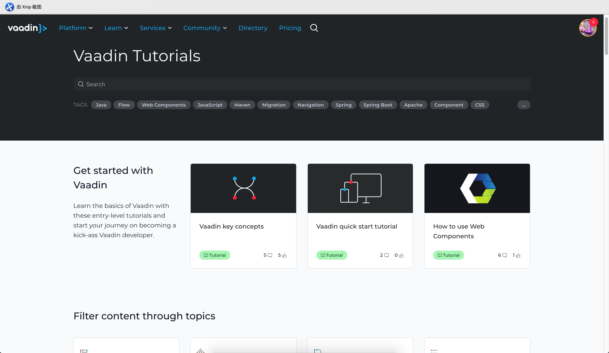

## 教程简介
新公司习惯使用Vaddin这套UI框架，而先前都是专注在Bootstrap或者基于Vue的UI框架或者其他主流框架，现今内部约定只能用这个，那么只能学习下这个东西了，说实在话心里很排斥继续学习这个UI框架，因为主流目前都是Vue这种了，再学这种的意义不是很大且浪费精力再研究一个未知的框架，且公司内部没有该框架的专业人士能够精通此UI框架，所以后续项目存在的风险其实还是很大的，不像其他框架的文献参考资料很多社区也很活跃，但是没办法，只能用这个，好吧认了，那就当一门新技术学习下并且记录下学习过程吧！没准能够发现新大陆。

## 学习资料说明
本教程针对vaddin10 LTS这个版本进行学习，其他版本暂不考虑，除非公司有特殊的需求满足不了，其他版本不考虑了。所有学习的资料均来自[Vaddin官网](https://vaadin.com/tutorials),我实在找不到活跃的社区学这一门技术，可怜的中文资料都没有，全TM是E文的，虽然E文的也可以但是作为一个中国人还是喜欢看中文的资料更加亲切，好吧认了

## 学习大纲和路径规划
本人从[Vaddin官网](https://vaadin.com/tutorials)列出的课程然后逐一的进行学习该独门绝技，🐎蛋内心暗骂。

接下来就是在工作之余每天更新下学习情况然后把自己学习过程中碰到的坑给大家排除下，帮助一起学习这个陌生框架的朋友，共同进步吧！！