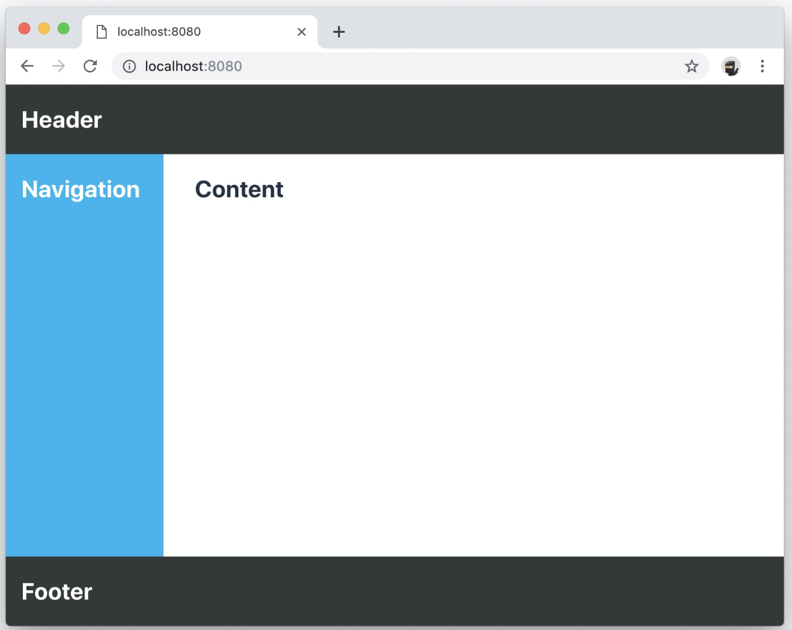
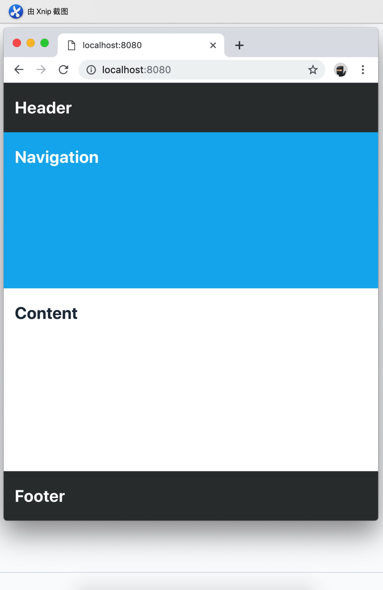
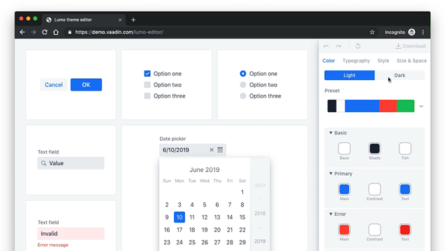

## 本文来源

本文来自[官网vaadin-key-concepts](https://vaadin.com/tutorials/vaadin-key-concepts)本人以便阅读理解以便做记录，一开始自己翻译但是水平有限顾谷歌翻译到此处，该文章主要是介绍vaadin这个框架的一些基本概念还有简单的使用方法，然后在文章中列举了一些相关资料的链接让新手可以快速的了解该框架，总体阅读下来觉得其实也很简单，只是中文资料比较少一起能讨论的人也比较少，在这里也想和大家一期探讨这个框架所以有需要的话后续创建一个微信群一期讨论下，我也是新手才学习这个东西。

本文旨在给Vaadin新人快速熟悉，让新手对基本概念及一些相关链接深入了解有一个快速的预览，在开发vaadin应用的时候也是一个快速的参考。
如果你还没有vaadin应用，可以从该地方配置下载[starter page.](https://vaadin.com/start)

## 基本概念 Core concepts

* 任何对象都是组件 Everything is a component

    应用内需要一个按钮那么就编写```new Button()```需要一个文本输入框?那就编写```new TextField()```通过使用已经存在的组件和布局构建自己的组件和视图。使用注解```@Route("path") ```来进行导航跳转

* 事件监听让有APP交互性 Listen to events to make your app interactive

    使用```addClickListener()```来给一个按钮添加监听事件，使用```addValueChangeListener()```获取select组建的变化事件，任何的组建都可以通过绑定事件监听来完成交互。

## Hello world

   这里有一个很小的但是完整的vaddin应用，代码如下MainView.java
   ```java
   @Route("")
   public class MainView extends VerticalLayout {
    public MainView() {
      add(new H1("Hello World!"));
    }
   }
   ```
   Vaadin使用基于组建的编程模式，在这个例子中，我们的应用是基于布局VerticalLayout继承后拓展的，在构造方法里面我们新增H1组件(等同于HTML页面中的H1标签)去显示Hello Word
   信息。
   
   最终我们使用```@Route("")```来映射应用到根路径来访问该视图

## 组件 Components

   Vaadin是基于组件的编程，它有大量的组建和布局来拓展和构建我们自己的组件，你可以在[这里](https://vaadin.com/components)找到这些组件

* 使用组件 Using components

    让我们来实例化一个新组件
    ```java
    Button button = new Button("Click me");
    button.setIcon(VaadinIcon.VAADIN_V.create());
    ```
    在vaadin中每个组件都代表一个JAVA对象，想使用一个组件创建一个新实例然后配置它，最方便有效的方式去探索组件的完整功能最方便从IDE里面提示去获取。
    
    组件仅仅自己本身无法满足需求的时候，我们就需要组合多个组件相互交互让整个大组件更有意义，如此我们就需要布局。
    
    
## 布局 Layouts

   布局是特殊的组件用于容纳其他组件和决定在浏览器中如何展现UI，因为布局本身就是组件，他们能内嵌或者创建复杂的布局。
   
   常见的布局将在Vaadin里面有如下：
    
* HorizontalLayout & VerticalLayout

   垂直布局和水平布局是众多vaadin应用的基础，依据他们自身名称的定义，他们自身排布子组件从顶层或者水平去排列他们。
   
   默认情况下，布局仅与其内容一样大，并且将在组件之间添加间距，以使布局更自然地读取和使用，对于布局周围的间距，可以使用setPadding（false）打开或关闭间距，对于组件之间的间距，可以使用setSpacing（false）打开或关闭间距。
   
   一个常见的要求是扩展一个组件以耗尽其他组件不需要的所有空间。这可以通过布局上的展开（组件）方法来实现。    
   
   以下是构建通用应用布局的操作概念示例。在这个例子中，我们通过Java以编程方式设置宽度和高度。您也可以通过CSS执行此操作，我们将在本指南的后面部分介绍。
   BasicLayoutView.java
   ```java
   @Route("")
   public class BasicLayoutView extends VerticalLayout {
   
    public BasicLayoutView() {
      // Instantiate layouts
      HorizontalLayout header = new HorizontalLayout();
      VerticalLayout navBar = new VerticalLayout();
      VerticalLayout content = new VerticalLayout();
      HorizontalLayout center = new HorizontalLayout();
      HorizontalLayout footer = new HorizontalLayout();
   
      // Configure layouts
      setSizeFull();
      setPadding(false);
      setSpacing(false);
      header.setWidth("100%");
      header.setPadding(true);
      center.setWidth("100%");
      navBar.setWidth("200px");
      content.setWidth("100%");
      footer.setWidth("100%");
      footer.setPadding(true);
   
      // Compose layout
      center.add(navBar, content);
      center.setFlexGrow(1, navBar);
      add(header, center, footer);
      expand(center);
    }
   }

   ```
   
* Div

  Div是所有布局中最灵活的，但它也要求您通过CSS自己处理所有定位。我们可以使用CSS flexbox布局来实现平滑的响应布局，以适应不同的视口大小。
   
  当我们使用CSS来布局组件时，我们需要为所有组件定义CSS类名。我们还需要添加@StyleSheet批注来加载CSS文件。

  DivLayoutView.java 
  ```java
  @Route("div")
  @StyleSheet("frontend://styles/div-layout-styles.css")
  public class DivLayoutView extends Div {

    public DivLayoutView() {
      // Instantiate layouts
      HorizontalLayout header = new HorizontalLayout();
      VerticalLayout navBar = new VerticalLayout();
      VerticalLayout content = new VerticalLayout();
      Div center = new Div();
      HorizontalLayout footer = new HorizontalLayout();

      // Configure layouts
      setSizeFull();
      header.setPadding(true);
      footer.setPadding(true);
      addClassName("main-view");
      header.addClassName("header");
      navBar.addClassName("navbar");
      center.addClassName("center");
      content.addClassName("content");
      footer.addClassName("footer");

      // Compose layout
      center.add(navBar, content);
      add(header, center, footer);
    }
  }
  ```
  在frontend / src / styles目录中创建CSS文件。这可能是webapp / frontend / src / styles /或META_INF / resources / frontend / src / styles /，具体取决于您使用的启动器。

  div-layout-styles.css
  ```css
  .main-view {
    display: flex;
    flex-direction: column;
  }

  .center {
    flex: 1;
    display: flex;
    flex-wrap: wrap;
  }

  .navbar {
    flex: 1;
    min-width: 200px;
  }

  .content {
    flex: 4;
    min-width: 500px;
  }
  ```
  根据您之前的开发背景，您可能会发现此方法比早期的编程方式更清晰。如果您作为团队的一员与设计人员合作，那么基于CSS的视图将更容易配置而无需触及Java代码。
* SplitLayout
* AppLayout
* FormLayout
* Declarative layouts 在HTML中申明式布局   

  有时您可能会发现在HTML中以声明方式定义布局更方便。Vaadin通过Template API支持此功能。声明性布局和模板被认为是更高级的主题。您可以在文档中了解有关创建声明性布局的更多信息。

## 事件监听 Listening to events   

  Vaadin是一个事件驱动的框架。用户可以与之交互的任何组件都将发出您可以收听的事件。
您将听到的典型事件是Button发出的click事件。
  ```java
  Button button = new Button("Click me");
  button.addClickListener(click -> {
    Notification.show("Thanks for clicking!");
  });
  ```
  在此示例中，我们在用户单击按钮时向其显示弹出通知。

## 创建组件 Creating components

  到目前为止，我们只考虑使用现有组件。在开发自己的Vaadin应用程序时，通常会创建自己的组件，以将系统的复杂部分封装到可重用的组件中。这构成了Vaadin和大多数其他现代UI框架使用的基于组件的编程模型的基础。

* 通过排版布局创建组件 Creating components through composition

  创建新组件的最常用方法是使用适合您的构建的API创建现有组件的组合。

  让我们看一个显示名片的组件的简单示例。

  BusinessCard.java
  ```java
  public class BusinessCard extends VerticalLayout {
    private Span name = new Span();
    private Span title = new Span();

    public BusinessCard() {
      add(name, title);
    }

    public void setName(String n) {
      name.setText(n);
    }

    public void setTitle(String t) {
      title.setText(t);
    }
  }
  ```

  一旦我们创建了这个组件，我们现在可以导入它并在我们的应用程序中使用它：

  ComponentView.java
  ```java
  @Route("component")
  public class ComponentView extends VerticalLayout {

    public ComponentView() {
      BusinessCard businessCard = new BusinessCard();
      businessCard.setName("Marcus");
      businessCard.setTitle("Computer code maker");

      add(businessCard);
    }
  }
  ```

  BusinessCard.java
  ```java
  public class BusinessCard extends Composite<VerticalLayout> {
    private Span name = new Span();
    private Span title = new Span();

    public BusinessCard() {
      getContent().add(name, title);
    }

    public void setName(String n) {
      name.setText(n);
    }

    public void setTitle(String t) {
      title.setText(t);
    }
  }
  ```

  在第二个版本中，我们隐藏了一个事实，即我们在内部使用VerticalLayout，只将setName和setTitle方法公开为公共API。Vaadin将在内部创建VerticalLayout，我们可以使用getContent（）获得。用作复合的组件需要有一个无参数构造函数，因此Vaadin可以实例化它们。

* 通过官方的设计器Vaadin Designer创建组件 Creating components with Vaadin Designer

  Vaadin Designer可视化构建器是一个工具，允许您使用拖放式界面而不是代码来构建组件和视图。当您需要创建许多视图或大型表单时，它可以是一个强大的工具。[youtube视频地址介绍](https://www.youtube.com/watch?v=2h75rbKRSbg&feature=youtu.be)

  您可以像在任何其他组件中一样在代码中使用Designer创建的组件。您还可以使用在Designer中手动编码的组件。

## 与JavaScript事件和DOM节点交互 Interacting with JavaScript events and DOM nodes

  在某些情况下，您需要构建一个仅通过组合现有组件无法构建的组件。Vaadin可以轻松扩展，以帮助在这种情况下。通过使用Element API，您可以访问DOM级事件和属性/属性。例如，让我们在组件上侦听鼠标悬停事件并将其记录到控制台：

  ```java
  businessCard.getElement().addEventListener("mouseover", e -> {
    System.out.println("'mouseover' event happened");
  });
  ```

  您可以阅读[有关侦听JavaScript事件](https://vaadin.com/docs/v13/flow/creating-components/tutorial-component-events.html)以及[使用文档中的HTML元素属性和属性](https://vaadin.com/docs/flow/creating-components/tutorial-component-basic.html)的更多信息。

## 创建自定义JS组件 Creating custom JavaScript components  

  您还可以在Vaadin中编写或集成完全自定义的UI组件。这些是更高级的主题，在文档中有更详细的介绍：阅读有关将[Web组件集成到Vaadin](https://vaadin.com/docs/v13/flow/web-components/integrating-a-web-component.html)的更多信息。阅读有关使用Element API[加载JavaScript文件](https://vaadin.com/docs/flow/importing-dependencies/tutorial-importing.html)和[创建组件](https://vaadin.com/docs/flow/creating-components/tutorial-component-basic.html)的更多信息。

## 表单和数据绑定 Forms and data binding 

  将数据从数据对象绑定到输入是大多数应用程序最重要的功能之一。Vaadin有一个强大的数据绑定API，允许您创建任何类型的形式，你可以想象。Vaadin Binder API支持验证整个表单的单个字段和跨字段验证。您还可以定义向用户显示的值与保存到对象的值之间的转换。

* 设置数据绑定 Setting up data binding

  Binder使用标准Java对象作为数据模型。它允许您将任何属性（getter / setter）绑定到UI字段。Binder支持单向数据绑定（readBean（模型））或双向数据绑定（setBean（模型））。阅读有关保存的部分，了解如何使用单向数据绑定从Binder中获取值。

  FormView.java

  ```java
  @Route("forms")
  public class FormView extends FormLayout {

    public FormView() {
      Person model = new Person();

      TextField firstNameField = new TextField("First Name");
      Binder<Person> binder = new Binder<>(Person.class);

      binder.forField(firstNameField).bind(Person::getFirstName, Person::setFirstName);

      // One-way data binding
      // binder.readBean(model);

      // Two-way data binding
      binder.setBean(model);
    }
  }
  ```
* 验证表单字段 Validating input fields

  大多数情况下，在构建表单时，我们需要验证我们收到的输入是否正确。在Vaadin中，这是通过向字段绑定添加Validator来完成的。

  ```java
  binder.forField(firstNameField)
  .asRequired()
  .withValidator(name -> name.equals("Marcus"), "Your name should be Marcus")
  .bind(Person::getFirstName, Person::setFirstName);
  ```

  在这里，我们强制输入字段，并要求输入值等于“Marcus”。您可以根据需要添加任意数量的验证器，它们将按您定义的顺序运行。

  阅读有关[字段验证](https://vaadin.com/docs/v13/flow/binding-data/tutorial-flow-components-binder-validation.html)以及如何对UI字段[使用JSR 303 Bean验证](https://vaadin.com/docs/v13/flow/binding-data/tutorial-flow-components-binder-beans.html)的更多信息。

* 输入值与模型数据转换 Converting between presentation and model values

  如果基础数据类型与UI组件的数据类型不匹配，则需要向绑定添加转换器。在下面的示例中，我们希望将TextField（String）绑定到基础int数据字段，因此我们需要添加StringToIntegerConverter。

  ```java
  binder.forField(ageField)
  .asRequired()
  .withConverter(new StringToIntegerConverter("Age must be a number"))
  .withValidator(age -> age > 2, "How are you using a computer?")
  .bind(Person::getAge, Person::setAge);
  ```

  [详细了解转换输入](https://vaadin.com/docs/v13/flow/binding-data/tutorial-flow-components-binder-validation.html)

* 表格验证跨域验证 Validating forms (cross-field validation)

  与向各个字段添加验证的方式相同，您还可以在绑定器上添加验证器以相互验证字段。只有在通过字段级验证后，才会运行活页夹级验证。我们还需要定义一个布局，我们希望在其中显示错误消息。
  ```java
  Div statusLabel = new Div();
  binder.setStatusLabel(statusLabel);
  binder.withValidator(person ->
    person.getFirstName().equals("Marcus")
    && person.getLastName().equals("Hellberg"),
    "Ha! You have the correct first name, but wrong last name. Better luck next life!");
  ```

* 保存 Saving
    * 双向数据绑定 Two-way data binding

      如果您使用双向数据绑定（setBean（），请参阅“将输入绑定到对象”），绑定对象将包含更新的值，前提是所有字段和表单级别的验证都已通过。

    * 单向数据绑定 One-way data binding

      如果使用单向数据绑定（readBean（），请参阅“将输入绑定到对象”），则需要手动读取表单。
      ```java
      try {
        Person saved = new Person();
        binder.writeBean(saved);
        // Persist saved bean
      } catch (ValidationException e){
        //show errors to user
      }
      ```

      您需要传递Binder一个实例来写入值。如果您使用单向数据绑定，通常不希望传入原始对象，因为这会使其变异。

      [阅读有关保存和验证表单的更多信息](https://vaadin.com/docs/v13/flow/binding-data/tutorial-flow-components-binder-load.html)

    
## 显示和延迟加载数据列表 Displaying and lazy loading lists of data  

  特别是在业务应用程序中，处理数据列表很常见。在Vaadin中，这通常使用[Grid](https://vaadin.com/components/vaadin-grid/java-examples)或[ComboBox](https://vaadin.com/components/vaadin-combo-box/java-examples)组件。

* 内存列表 In-memory list

  如果您有少量项目，比如几百项，处理这些项目最简单的方法就是将java Collection传递给setItems方法。

  Vaadin在服务器上运行UI代码。性能问题的最常见原因之一是开发人员在其组件中保留对大型集合的引用。如果您需要显示更多的集合，或者需要记忆，请查看下面的替代DataProvider API。

  GridView.java
  ```java
  @Route("grid")
  public class GridView extends VerticalLayout {

    public GridView(AddressBook addressBook) {
      Grid<Person> grid = new Grid<>();
      grid.addColumn(Person::getFirstName).setHeader("First Name");
      grid.addColumn(Person::getLastName).setHeader("Last Name");
      grid.addColumn(Person::getAge).setHeader("Age");

      List<Person> everyone = addressBook.findAll();
      grid.setItems(everyone);

      add(grid);
    }
  }
  ```

* 使用DataProvider进行延迟加载 Lazy-loading with DataProvider

  如果您有大量数据，那么只在特定时刻加载所需的数据是有意义的。如果定义DataProvider，则Grid和ComboBox等Vaadin组件会自动执行此操作。不像我们在前面的代码片段中那样调用setItems（），而是使用setDataProvider（）。

  GridView.java
  ```java
  grid.setDataProvider(DataProvider.fromCallbacks(
    findQuery -> addressBook.find(
      findQuery.getOffset(),
      findQuery.getLimit()),
    countQuery -> addressBook.count()));
  ```
  数据提供程序采用两个回调函数。第一个查询应返回具有给定偏移量和限制的对象流，即下一页数据。第二个查询返回数据集中对象的总数。这用于在UI中显示适当的滚动条和信息。

  无论使用setItems（）还是setDataProvider（），最终用户体验都是相同的。在这两种情况下，用户都可以在整个数据集中自由滚动。唯一的区别是，使用DataProvider时，您在服务器上使用的资源更少。

  阅读有关[使用DataProvider对延迟加载的数据进行排序和过滤](https://vaadin.com/docs/flow/binding-data/tutorial-flow-data-provider.html)的信息。

## 视图和导航 Views and navigation 

  Vaadin配备了一个简单但功能强大的导航系统。任何组件都可以成为导航目标，您可以轻松捕获URL参数。

* 定义路线 Defining routes

  要定义路线，请使用@Route为您的班级添加注释。
  
  SampleView
  ```java
  @Route
  public class SampleView extends VerticalLayout {

    public SampleView() {
      add(new H1("I am a sample view"));
    }
  }
  ```
  默认情况下，Vaadin将根据类名确定路径路径，而不使用-View结尾。在这种情况下，视图将映射到/ sample。
  
  在许多情况下，最好明确命名并明确定义路径。为此，建议使用常量来支持稍后的重构。

  SampleView
  ```java
  @Route(SampleView.NAME)
  public class SampleView extends VerticalLayout {
    public static final String NAME = "sample";

    public SampleView() {
      add(new H1("I am a sample view"));
    }
  }
  ```

* 在视图之间导航 Navigating between views

  定义视图后，可以通过两种方式导航到该视图。使用路由器链接或以编程方式。要使用路由器链接，
  
  请将RouterLink组件添加到布局中。
  ```java
  add(new RouterLink("Go to the sample view!", SampleView.class));
  ```

  路由器链接的优点是，即使服务器会话已过期，它们也将继续工作。在某些情况下，您需要以编程方式导航到另一个视图。例如，在填写表单后将用户带到另一个视图。为此，请使用ui.navigate（）。
  ```java
  Button saveButton = new Button("Save");
  saveButton.addClickListener(click -> {
    // (Save form logic omitted)

    // On success, navigate to another view
    saveButton.getUI().ifPresent(ui -> ui.navigate(SampleView.NAME));
  });
  ```

  UI是Vaadin应用程序的不可见“根”。每个浏览器选项卡有一个UI。UI主要用于在从外部线程更新UI状态时导航或同步访问。

* 嵌套路由，参数，错误页面 Nested routes, parameters, error pages

  你可以做比上面更复杂的导航系统。请参阅文档以了解有关[嵌套路由](https://vaadin.com/docs/v13/flow/routing/tutorial-router-layout.html)，[URL参数](https://vaadin.com/docs/flow/routing/tutorial-router-url-parameters.html)和[处理导航异常](https://vaadin.com/docs/v13/flow/routing/tutorial-routing-exception-handling.html)的更多信息。

## 测试 Testing    

  测试是开发可靠应用程序的重要部分。您将为应用程序编写通常有三种类型的测试：单元测试，集成测试和端到端系统测试。
  
  我们来看一个例子。这是我们正在测试的组件：

  ExampleComponent.java
  ```java
  @Route
  public class ExampleComponent  extends VerticalLayout {
    private final Binder<Person> binder;
    private BackendService service;

    TextField firstName = new TextField("First Name");
    TextField lastName = new TextField("Last Name");
    Button saveButton = new Button("Save");

    public ExampleComponent(BackendService service) {
      this.service = service;
      add(firstName, lastName, saveButton);
      binder = new Binder<>(Person.class);
      // Bind fields to bean by name
      binder.bindInstanceFields(this);
      saveButton.addClickListener(click -> save());
    }

    public void save() {
      try{
        Person person = new Person();
        binder.writeBean(person);
        service.save(person);
        saveButton.setText("Saved");
      } catch (ValidationException e) {
        e.printStackTrace();
      }
    }
  }
  ```

  它是一个带有名字和姓氏的文本字段的表单，通过Binder绑定到Person对象。如果您不熟悉Binder，请参阅上面有关表格的部分。保存表单时，生成的Person对象应保存到BackendService。

* 单元和集成测试 Unit and integration testing

  单元和集成测试通常构成应用程序的大部分测试。测试不需要启动服务器或浏览器，因此它们可以快速运行。单元测试和集成测试的实现非常相似。主要区别在于，在单元测试中，您单独测试单个代码（例如组件），而在集成测试中，您可以一起测试多个互连的内容。要为上面的组件编写单元测试，我们需要一个测试库来运行代码和一个模拟库，以便将依赖性存根到未经过测试的功能。在这个例子中，我们使用的是jUnit 5和Mockito。

  ExampleComponentTest.java
  ```java
  class ExampleComponentTest {

    private ExampleComponent component;
    private BackendService serviceMock;

    @BeforeEach
    void setUp() {
      serviceMock = Mockito.mock(BackendService.class);
      component = new ExampleComponent(serviceMock);
    }

    @Test
    void save() {
      component.firstName.setValue("Marcus");
      component.lastName.setValue("Hellberg");

      component.save();

      // Person.equals is based on names in this example
      Mockito.verify(serviceMock).save(new Person("Marcus", "Hellberg"));
    }
  }
  ```

  在测试中，我们设置了BackendService的模拟版本，因为我们将测试重点放在ExampleComponent上。我们所需要的只是验证它是否会通过正确的输入进行调用。在测试中，我们通过在文本字段中输入值来设置UI状态。然后，我们调用save（）并验证是否已使用具有正确名字和姓氏的Person对象调用后端服务。我们也可以通过使用BackendService的实际实现而不是将其存根来进行集成测试。

* 端到端测试（浏览器内测试） End-to-end testing (in-browser testing)

  在端到端测试中，我们确保整个应用程序作为一个整体运行。为此，我们需要设置服务器来部署应用程序并设置浏览器测试环境。Vaadin有一个名为TestBench的官方浏览器测试工具。它负责启动浏览器，并具有Vaadin特定的选择器，用于在浏览器中查找UI组件。要通过浏览器在其真实环境中测试组件，我们可以编写以下TestBench测试用例。

  ExampleComponentIT.java
  ```java
  public class ExampleComponentIT extends TestBenchTestCase {

  @Before
  public void setup() throws Exception {
      setDriver(new ChromeDriver());
      getDriver().get("http://localhost:8080/example");
    }

    @Test
    public void clickButton() {
      ButtonElement button = $(ButtonElement.class).first();
      button.click();
      Assert.assertEquals("Saved", button.getText());
    }

    @After
    public void tearDown() throws Exception {
      getDriver().quit();
    }
  }
  ```

  在运行测试之前，我们设置了一个新的Chrome浏览器驱动程序并打开了该组件的路径。然后我们找到按钮，单击它，并断言标题已正确更新。

  如您所见，此测试非常粗糙。它只能告诉我们一切是否有效，或者是否有失败。它不会给我们提供有关出错的信息。因此，最好有一套全面的细粒度单元和集成测试来查明问题。TestBench更适用于高级别，最后一道防线，即使其他测试都错过了也可以捕获错误的测试。
  
  阅读有关使用[TestBench](https://vaadin.com/testbench)创建可靠且可维护的测试的更多信息。

## 使用CSS设计样式 Styling with CSS 

  所有Vaadin组件都附带一个名为Lumo的可配置主题。Lumo允许您配置颜色，字体，大小调整，圆度和间距等内容，以使组件集看起来像您想要的那样。配置基于CSS自定义属性（变量），可确保所有组件看起来一致。

    

  探索选项和配置CSS变量值的最简单方法是使用[Lumo主题编辑器](https://demo.vaadin.com/lumo-editor/)。Vaadin应用程序可以进一步使用CSS进行自定义。

  阅读有关[样式化Vaadin应用程序](https://vaadin.com/docs/v13/flow/theme/theming-overview.html)的更多信息。

## 生产 Production   

  当您准备好将应用程序投入生产时，请运行：
  ```
  mvn clean package -PproductionMode
  ```

  这将构建一个缩小的捆绑包并创建IE11支持所需的ES5版本。

  [阅读有关生产版本的更多信](https://vaadin.com/docs/flow/production/tutorial-production-mode-basic.html)

## 下一步 Next steps

  现在您已了解基础知识，您可以开始构建自己的应用程序。如果您想学习如何使用数据绑定和数据库构建完整的应用程序，请从[基本的Vaadin教程](https://vaadin.com/tutorials/getting-started-with-flow/setting-up-the-project)开始。如果您更喜欢观看视频，我们有一个关于Vaadin基础知识的[免费在线视频课程](https://vaadin.com/training/courses)（需要vaadin.com帐户）。如果您想浏览所有教程和学习资料，请访问[Vaadin学习中心](https://vaadin.com/tutorials)。如果您只是想修补一下，请查看[组件的代码段](https://vaadin.com/components)或转到[完整文档](https://vaadin.com/docs/index.html)，以更深入地解释Vaadin的工作原理。
    
    
          
    