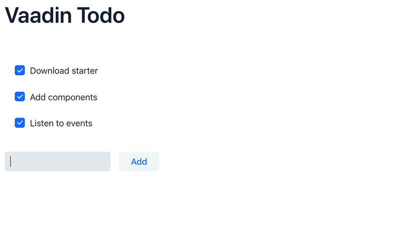

## 本文来源

本文来自[官网Vaadin quick start tutorial](https://vaadin.com/tutorials/vaadin-quick-start)该文章看下来就是从官方的starter页面下载一个界面然后按照流程简单修改下代码然后实现一个todo list的小APP，讲解了事件监听的东西，没有啥难点，最后提供了些学习链接

在这个2分钟的教程中，您将学习如何构建一个小型但功能齐全的Vaadin应用程序。
这个简单的示例将教您基于组件的开发和监听事件的基础知识。

[youtube视频地址](https://youtu.be/6kDCn6OvXkA)

您将构建的应用程序是经典的Todo应用程序。


## 先决条件 Prerequisites

本教程假设您在计算机上进行了以下设置：Java 8或更高版本像IntelliJ，Eclipse或Netbeans这样的IDEMaven的

  * 下载并导入 Download and import the app starter

    [下载起动器](https://vaadin.com/start/latest/project-base)

    下载完启动器后，解压缩该文件并在IDE中打开它。确保您可以通过运行spring-boot：run Maven目标来启动项目。如果您在导入或运行应用程序时需要帮助，可以找到有关IntelliJ，Eclipse和Netbeans的详细说明。

  * 准备项目 Prepare the project  

    入门包含一些我们在本教程中不需要的功能和代码。让我们从一个干净的石板开始，删除我们不需要的一切：

    ```java
    -@PWA(name = "Project Base for Vaadin Flow with Spring", shortName = "Project Base")

    public class MainView extends VerticalLayout {

      - public MainView(@Autowired MessageBean bean) {
      + public MainView() {
      -   Button button = new Button("Click me",
      -       event -> Notification.show("Clicked!"));
      -   add(button);
      }
    }
    ```

    我们现在准备开始构建应用程序。

  * 使用组件和布局构建UI Building UIs with components and layouts

    Vaadin是一个基于组件的框架。您可以通过实例化组件并将它们放入确定如何显示它们的布局来构建用户界面。MainLayout.java扩展了VerticalLayout。这意味着添加的每个组件都放在前一个组件的下方。Vaadin在布局和组件周围添加了填充，以提高视觉清晰度。  

    

    首先，创建应用程序所需的所有组件：

    MainLayout.java
    ```java
    @Route("")
    public class MainView extends VerticalLayout {

      public MainView() {
        VerticalLayout todosList = new VerticalLayout(); // 
        TextField taskField = new TextField(); // 
        Button addButton = new Button("Add"); // 
      }
    }
    ```

    * todosList是一个垂直布局，将显示任务和复选框
    * taskField是新任务的文本输入字段
    * addButton将触发逻辑以将新项添加到我们的待办事项列表中

    如果您仍在运行服务器，则可以构建项目，Spring Boot DevTools应该接收更改。如果没有，请运行spring-boot：根据“下载并导入app starter”部分中的说明运行Maven目标。导航到localhost：8080，您应该看到以下内容：

   

  * Listen to button click events to add new todo items

    我们现在已经有了应用程序的主要结构。但该应用程序没有做任何事情。我们需要在按钮上附加一些功能，将其转换为实际的工作应用程序。Vaadin使用事件驱动的编程模型。这意味着您可以侦听组件上的事件以获得您感兴趣的交互通知。在我们的示例中，我们希望在Add-button上侦听click事件并附加用于向列表添加新todo项的逻辑。

    MainLayout.java

    ```java
    @Route("")
    public class MainView extends VerticalLayout {

      public MainView() {
        // Component definitions omitted

        addButton.addClickShortcut(Key.ENTER);
          addButton.addClickListener(click -> {
            // 
            Checkbox checkbox = new Checkbox(taskField.getValue());
            todosLayout.add(checkbox);
          }
        );

        add(
          new H1("Vaadin Todo"),
          todosList,
          new HorizontalLayout(
              taskField,
              addButton
          ),
          stats
        );
      }
    }
    ```

    使用taskField中的值作为标签创建一个复选框。

    刷新浏览器，然后尝试将一些项目添加到列表中。

     

    恭喜，您已经完成了第一个Vaadin申请！

## 下一步 Next steps    

  要了解有关Vaadin的更多信息，请参阅以下教程。

* [免费在线视频课程，涵盖Vaadin基础知识](https://vaadin.com/training/courses)
* [CRUD应用教程](https://vaadin.com/tutorials/getting-started-with-flow)
    
  如果您更像是修补匠，您还可以浏览[组件示例](https://vaadin.com/components)，并使用您刚刚构建的应用程序作为沙箱来自行尝试。


