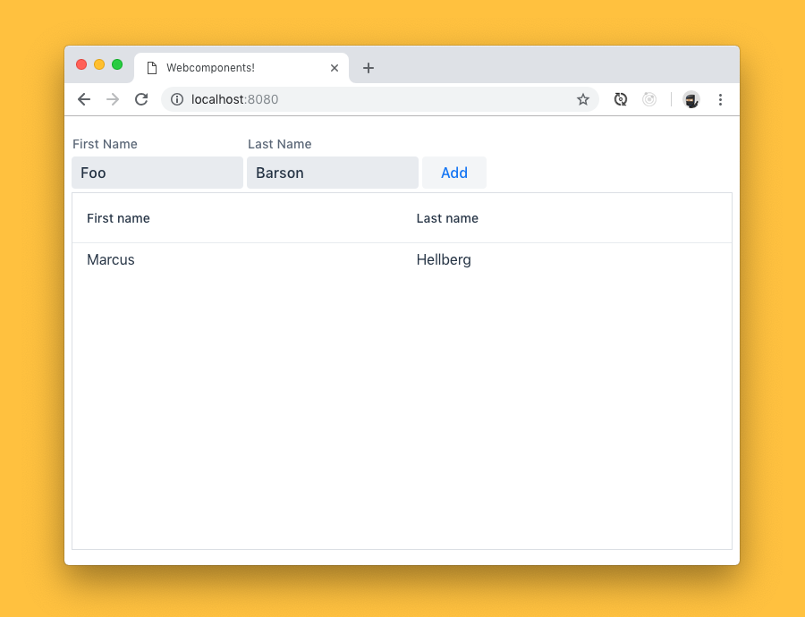

## 本文来源

本文来自[官网Vaadin quick start tutorial](https://vaadin.com/tutorials/using-web-components)

本教程将教您如何使用Web组件并与之交互。我们将构建一个小型UI，将人员添加到数据网格中。



大多数Web组件（如Vaadin组件集）都作为ES模块分发。要有效地使用它们，您需要拥有Webpack，Parcel或Rollup等构建工具。如果您已有一个处理ES模块的现有项目，请随时直接跳到步骤1。

## [第0步：构建工具 Step 0: Build tooling](https://youtu.be/KXjA52xat7Y)

### 创建和初始化项目 Create and init project

    首先创建一个新文件夹并在其中初始化NPM。

    ```java
    $ mkdir webcomponents
    $ cd webcomponents
    $ npm init -y (1)
    ```

    -y标志默认为所有NPM init问题回答“是”。如果要自定义答案，请忽略它。

    然后，安装Webpack和插件：

    ```java
    $ npm install --save-dev webpack webpack-dev-server webpack-cli html-webpack-plugin
    ```

### 项目结构 Project structure    

    在您创建的webcomponents目录中，创建另一个文件夹：src。在其中，创建index.html和index.js。暂时将index.js留空。将以下内容添加到index.html：

    src/index.html

    ```html
    <!DOCTYPE html>
    <html lang="en">
        <head>
            <title>Webcomponents!</title>
        </head>
        <body>
            Yay!
        </body>
    </html>
    ```

### 配置 Webpack Configure Webpack  

    在项目的根目录中，创建一个webpack配置文件webpack.config.js：

    webpack.config.js

    ```javascript
    const HtmlWebpackPlugin = require('html-webpack-plugin');

    module.exports = ({ mode }) => {
        return {
            mode, 
            plugins: [
            new HtmlWebpackPlugin({
                template: './src/index.html' 
            })
            ],
            devtool: mode === 'development' ? 'source-map' : 'none' 
        };
    };
    ```

    * 配置mode属性。这将从命令行设置，可以是开发或生产。
    * 告诉HtmlWebpackPlugin使用我们的索引文件而不是生成自己的索引文件。
    * 启用源映射以进行开发

### 添加用于运行应用程序的脚本 Add scripts for running the app   

    在package.json中定义两个NPM脚本，用于运行和构建应用程序。

    ```javascript
    "scripts": {
        -    "test": "echo \"Error: no test specified\" && exit 1"
        +    "dev": "webpack-dev-server --env.mode development",
        +    "prod": "webpack --env.mode production"
    },
    ```

    在此之后，您可以使用npm run dev启动开发服务器，或使用npm run prod构建生产优化的构建。
    
    您对源代码所做的任何更改都会在开发期间自动编译并反映在浏览器中。

## [第1步：使用Web组件 Step 1: Using Web Components](https://youtu.be/88Sa-SlHRxk)    

### 安装组件 Install the components

    使用Web组件的第一步是安装它们。在这种情况下，我们从Vaadin组件集中安装vaadin-text-field，vaadin-button和vaadin-grid。除了组件之外，我们还安装了webcomponentsjs，这是一个用于添加对旧版浏览器的支持的polyfill。

    ```java
    $ npm install --save @vaadin/vaadin-text-field @vaadin/vaadin-button @vaadin/vaadin-grid
    ```

    安装完成后，导入index.js中的组件以使其可供浏览器使用。

    src/index.js

    ```javascript
    import '@vaadin/vaadin-button';
    import '@vaadin/vaadin-grid';
    import '@vaadin/vaadin-text-field';
    ```

### 为旧版浏览器添加polyfill Add polyfills for older browsers    

    尽管大多数现代浏览器都内置了对Web组件的支持，但仍然存在使用旧版浏览器的用户。如果您想让他们的应用程序可用，您希望包含在没有本机支持的情况下在浏览器中模拟功能的polyfill。webcomponents.js polyfill附带一个加载程序脚本，可用于仅加载特定浏览器所需的polyfill。它动态加载polyfill，因此不能直接导入由Webpack构建的JS依赖项，而是需要复制依赖项并将加载器包含在索引文件中。该库还包含一个ES5兼容性脚本，以防您将应用程序转换为ES5。

    ```java
    $ npm install --save-dev copy-webpack-plugin @webcomponents/webcomponentsjs
    ```

### 复制polyfills Copy polyfills    

    我们需要做的第一件事是复制polyfill。如果您使用的是与Webpack不同的构建工具，请参阅该工具的文档，了解如何复制静态资产。

    webpack.config.js

    ```javascript
    const HtmlWebpackPlugin = require('html-webpack-plugin');
    +const CopyWebpackPlugin = require('copy-webpack-plugin');

    module.exports = ({ mode }) => {
    return {
        mode,
        plugins: [
        new HtmlWebpackPlugin({
            template: './src/index.html'
        }),
    +      new CopyWebpackPlugin([
    +        {
    +          context: 'node_modules/@webcomponents/webcomponentsjs',
    +          from: '**/*.js',
    +          to: 'webcomponents'
    +        }
    +      ])
    +    ],
        devtool: mode === 'development' ? 'source-map' : 'none'
    };
    };
    ```

### 加载polyfill

    然后，在index.html的<head>部分中包含加载程序和ES5兼容性脚本的可选导入。

    src/index.html

    ```html
    <script src="webcomponents/webcomponents-loader.js"></script>
    <script>
    if (!window.customElements) { document.write('<!--'); }
    </script>
    <script src="webcomponents/custom-elements-es5-adapter.js"></script>
    <!-- ! DO NOT REMOVE THIS COMMENT, WE NEED ITS CLOSING MARKER -->
    ```

    您现在可以在IE11 +和任何常绿浏览器中使用Web组件。

### 使用Web Components构建UI Use Web Components to build the UI  

    安装组件后，可以像使用任何其他HTML标记一样使用它们。用以下内容替换index.html的正文内容：

    src/index.html

    ```html
    <div class="form">
    <vaadin-text-field label="First Name" id="firstName"> </vaadin-text-field>
    <vaadin-text-field label="Last Name" id="lastName"> </vaadin-text-field>
    <vaadin-button id="addButton"> Add </vaadin-button>
    </div>
    <vaadin-grid id="grid">
    <vaadin-grid-column path="firstName" header="First name"> 
    </vaadin-grid-column>
    <vaadin-grid-column path="lastName" header="Last name">
    </vaadin-grid-column>
    </vaadin-grid>
    ```

    网格使用对象数组作为其数据源。path属性定义该对象应在列中显示的属性。

    请注意，我们为所有组件添加了id属性。Ids让我们更容易在下一步中从JavaScript中获取它们。

### 侦听事件并更新属性 Listen for events and update properties   

    现在我们已经准备好了所有的UI构建块，下一步就是添加一些功能。

    首先在index.js中添加一个调用函数initUI（）的load事件监听器。

    src/index.js

    ```javascript
    window.addEventListener('load', () => {
        initUI();
    });
    ```

    在initUI函数中正在进行相当数量的操作，所以让我们一步一步地看看正在发生的事情：

    src/index.js

    ```javascript
    function initUI() {
        const firstNameField = document.querySelector('#firstName');
        const lastNameField = document.querySelector('#lastName');
        const addButton = document.querySelector('#addButton');
        const grid = document.querySelector('#grid'); 

        let people = []; 

        addButton.addEventListener('click', e => { 
            people = [ 
            ...people,
            {
                firstName: firstNameField.value,
                lastName: lastNameField.value
            }
            ];
            grid.items = people; 
            firstNameField.value = ''; 
            lastNameField.value = '';
        });
    }
    ```

    通过document.querySelector获取对组件的引用

    定义一个数组来保存添加的人员。

    在按钮上添加单击侦听器以添加人员。

    创建一个包含所有先前人员和新创建人员的新阵列。可以从组件的value属性中检索名称值。

    将new people数组设置为网格上的items属性以显示更新的数据。

    清除输入字段。

    运行应用程序，您现在应该可以向网格添加新条目。

## 总结和后续步骤 Summary and next steps    

    导入后，Web Components的行为与任何其他HTML元素相同。您可以设置和读取数据的属性和属性，并侦听事件以添加交互性。

    Web组件旨在独立于框架。您可以将它们与框架或模板库一起使用，以减少手动查询元素和设置其值的样板。有关详细信息，请参阅我们在常用框架中使用Web组件的任何其他指南。


