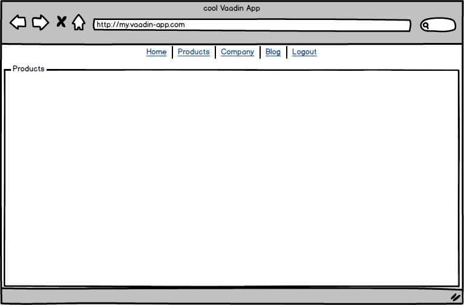

## 本文来源

本文来自[官网Vaadin app layout](https://vaadin.com/tutorials/app-layout/vaadin)

## 介绍

  Web应用程序可以针对各种各样的受众。在我们的例子中，我假设一个用于支持公司内部流程的Web应用程序。这是一个典型的业务应用程序，几乎每个开发人员都可以看到它。此领域的Web界面通常基于经典桌面应用程序的体验。

## 最低要求 

  在我们的最小版本中，我们假设应用程序标题中将有一个菜单。菜单条目的数量限制为四到五个，因此对屏幕没有挑战。当然，假设使用的术语比某些德语单词略短，例如“Gleisschotterrbettungsreinigungsmaschine”。

## 布局

  Web应用程序布局是一个框架，其中包含菜单标题和视图槽。在这里，我们第一次遇到挑战，导航不应该替换整个窗口的内容，只能替换显示视图的区域。下图说明了结构。

  

  视图显示在标记为“产品”的区域中。

## 基本结构

  这里使用的基本框架基于Vaadin的[App Layout组件](https://vaadin.com/components/vaadin-app-layout)。App Layout使用RouterLayout处理路由。从Vaadin的AppLayout开始，我们将创建一个名为MainLayout的类，扩展AbstractAppRouterLayout类。

  如果您使用以下依赖项，则组件应用程序布局已在类路径中可用。

  ```xml
  <dependency>
    <groupId>com.vaadin</groupId>
    <artifactId>vaadin</artifactId>
  </dependency>
  ```

  如果不是，则相应的maven依赖关系是

    ```xml
    <dependency>
        <groupId>com.vaadin</groupId>
        <artifactId>vaadin-app-layout-flow</artifactId>
    </dependency>
  ```

  要实现的方法名称为configure，需要两个参数。第一个是生成的AppLayout的实例，第二个是AppLayout中使用的菜单。基于这两个实例，您可以从设计开始。除了放置在左上角的徽标外，您还可以设置菜单项。使用类AppLayoutMenuItem的实例创建菜单项本身。可以选择不同的组合。例如，可以使用图标加上描述和导航目标，或者使用ActionListener而不是导航目标的定义。

  ```java
  public class MainLayout extends AbstractAppRouterLayout {

    private static final String LOGO_PNG = "logo.png";

    public static final String ITM_DASHBOARD = "mainview.menue.item.dashboard";
    public static final String ITM_PROFILE = "mainview.menue.item.profile";
    public static final String ITM_TRENDS = "mainview.menue.item.trends";
    public static final String ITM_LOGOUT = "mainview.menue.item.logout";

    @Override
    protected void configure(AppLayout appLayout ,
                            AppLayoutMenu appLayoutMenu) {

      StreamResource res = new StreamResource(LOGO_PNG ,
                                              () -> MainView.class.getResourceAsStream("/" + LOGO_PNG));
      Image img = new Image(res , "Vaadin Logo");

      img.setHeight("44px");
      appLayout.setBranding(img);

      appLayoutMenu
          .addMenuItems(
              new AppLayoutMenuItem(DASHBOARD.create() ,
                                    appLayout.getTranslation(ITM_DASHBOARD) ,
                                    DashboardView.NAV) ,
              new AppLayoutMenuItem(USER.create() ,
                                    appLayout.getTranslation(ITM_PROFILE) ,
                                    ProfileView.NAV) ,
              new AppLayoutMenuItem(TRENDING_UP.create() ,
                                    appLayout.getTranslation(ITM_TRENDS) ,
                                    TrendsView.NAV) ,
              new AppLayoutMenuItem(SIGN_OUT.create() ,
                                    appLayout.getTranslation(ITM_LOGOUT) ,
                                    e -> {
                                      UI ui = UI.getCurrent();
                                      VaadinSession session = ui.getSession();
                                      session.setAttribute(SecurityService.User.class , null);
                                      session.close();
                                      ui.navigate(MainView.class);
                                    }));
    }
  }
  ```

  此示例使用[Flow的I18Provider](https://vaadin.com/tutorials/i18n)。要了解更多相关信息，我建议使用有关Flow国际化的教程

  要立即使用布局，必须将具有类MainLayout的属性布局分配给@Route注释中的参与视图。

  ```java
  @Route(value = MainView.NAV_MAIN_VIEW, layout = MainLayout.class)
  public class MainView extends Composite<Div> implements HasLogger {
    public static final String NAV_MAIN_VIEW = "main";

    public MainView() {
      getContent().add(new Span("Page content"));
    }
  }
  ```

## 摘要

  我们现在有一个简单的应用程序框架，具有当今典型的结构。功能是有限的，但有时这是足够的。但是，如果您想要更广泛的选项，可以在[Vaadin目录](https://vaadin.com/directory)中查看替代方案或使用功能更全面的[Business App启动器](https://vaadin.com/start/latest/business-app)。我将在本系列的下一部分中仔细研究其他几个。

  